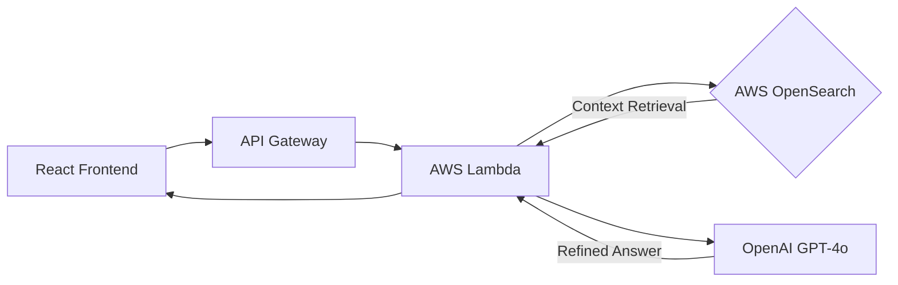

This is a professional, high-quality README.md template tailored specifically for an AI Customer Success Chatbot using your AWS + OpenAI + React stack.

You can copy-paste this directly into your project.

# 🤖 AI Customer Success Assistant
> An enterprise-grade RAG-based chatbot designed to automate support and enhance customer experience.

[](https://reactjs.org/)
[](https://openai.com/)
[](https://aws.amazon.com/)
[](https://opensearch.org/)

---

## 🌟 Overview
This project is an AI-driven Customer Success solution that leverages **Retrieval-Augmented Generation (RAG)**. It provides real-time, context-aware answers to customer queries by searching through proprietary company documentation stored in a vector database, ensuring high accuracy and reducing "hallucinations."

### Key Features
* **Contextual Intelligence:** Uses AWS OpenSearch to retrieve relevant documentation before generating answers.
* **Streaming UI:** A modern React interface with real-time "typing" responses.
* **Serverless Scalability:** Built on AWS Lambda to handle fluctuating traffic with zero server management.
* **Secure Data:** PII masking and secure credential management via AWS Secrets Manager.

---

## 🏗 Architecture
The system follows a standard RAG pipeline to ensure the chatbot only answers based on verified company data.



| Component | Technology | Responsibility |
|-----------|-----------|-----------------|
| Frontend | React.js / Tailwind | User interface, session state, and Markdown rendering. |
| Orchestrator | AWS Lambda (Node/Python) | Handling logic, embedding queries, and prompt construction. |
| Vector Store | AWS OpenSearch | High-speed k-NN similarity search for support docs. |
| LLM | OpenAI (GPT-4o) | Natural language generation and intent reasoning. |
| API Layer | AWS API Gateway | Secure REST/WebSocket endpoints. |

## 🚀 Getting Started

### Prerequisites
* Node.js (v18+)
* AWS CLI configured with appropriate permissions
* OpenAI API Key

### Installation
Clone the repository
```bash
git clone https://github.com/your-org/cs-ai-bot.git
cd cs-ai-bot
```

### Backend Setup (AWS Lambda)
* Navigate to /backend
* Install dependencies: `npm install`
* Deploy using SAM/Serverless Framework: `sls deploy`

### Frontend Setup
* Navigate to /frontend
* Add your API endpoint to .env:
```
REACT_APP_API_URL=https://your-api-gateway-url.com/prod
```
* Run locally: `npm start`

## 🧠 How RAG Works in This Project
* **Ingestion:** Help center articles are chunked, converted into embeddings via OpenAI text-embedding-3-small, and stored in AWS OpenSearch.
* **Retrieval:** When a customer asks a question, the system searches OpenSearch for the top 3 most relevant text segments.
* **Generation:** The segments + the user question are sent to GPT-4o with a system prompt: "Only use the provided context to answer. If the answer isn't there, suggest contacting a human."

## 🛡 Security & Guardrails
* **Data Privacy:** Customer queries are scrubbed for PII before being sent to the LLM.
* **Thresholding:** If OpenSearch returns a confidence score < 0.7, the bot automatically triggers a "Hand-off to Human" workflow.
* **Rate Limiting:** Managed via API Gateway to prevent API cost spikes.

## 📈 Roadmap
- [ ] Integration with Zendesk/Intercom for human hand-off.
- [ ] Multi-language support (Spanish, French, German).
- [ ] Automated daily re-indexing of S3 documentation.

## 🧪 LLM Evaluations & Quality Assurance

In this section, we discuss the tools used for evaluations and quality assurance of LLM (Large Language Model) outputs within a CI/CD environment.

### PromptFoo with GPT-4 as Judge
PromptFoo integrates with GPT-4 to serve as an intelligent judge in our CI/CD pipelines. This setup enables automated evaluations of text outputs based on predefined criteria, ensuring that the generated content meets quality standards before deployment.

### Galileo for Runtime Monitoring
Galileo provides runtime monitoring capabilities for our models in production. This tool assists in evaluating model performance, tracking various metrics, and ensuring that output remains aligned with expected quality throughout the application's lifecycle.