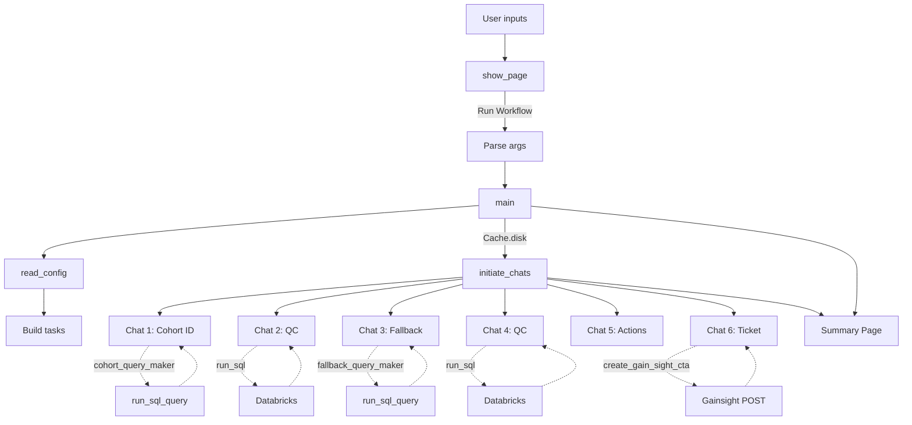

# `src/multi_agent_workflow.py` — Multi-Agent Workflow Documentation

Source: https://github.com/JohnDeere-Tech/csm-mvp/blob/main/src/multi_agent_workflow.py

## Overview

This module runs a **Streamlit-driven, multi-agent Autogen workflow** that:

1. Collects threshold/date inputs from a user (Streamlit UI).
2. Loads config defaults (if inputs are missing).
3. Builds a sequence of task prompts (`csm_tasks`) from `config.tasks`.
4. Orchestrates a series of agent-to-agent chats via `autogen.initiate_chats`.
5. Enables agents to:
   - Generate SQL via LLM prompts (`cohort_query_maker`, `fallback_query_maker`)
   - Execute SQL against Databricks (`run_sql_query`)
   - Create a Gainsight CTA ticket (`create_gain_sight_cta`)

At the end, it shows a simple Streamlit summary of the input parameters.

---

## Key Components

### Agents (created at import time)

```python
(orchestrator_agent, cohort_identifier_agent, fallback_reasoning_agent,
 action_advisor_assistant_agent, ticket_creator_agent,
 quality_controller_agent) = create_agents()
```

- **orchestrator_agent**: initiates and coordinates the sequence of chats.
- **cohort_identifier_agent**: identifies the cohort; can generate and run SQL.
- **fallback_reasoning_agent**: determines fallback reasons; can generate and run SQL.
- **action_advisor_assistant_agent**: produces recommended actions (summarized).
- **ticket_creator_agent**: creates Gainsight CTA records via an API call.
- **quality_controller_agent**: performs quick QC checks; can also run SQL.

---

## Tool / Function Interfaces Exposed to Agents

These functions are registered as tools via Autogen decorators so that agents can call them during chats.

### `cohort_query_maker(user_input) -> dict[str, Any]`

Registered for:

- orchestrator execution
- cohort_identifier_agent LLM tool use (name: `cohort_query_maker`)

Purpose:

- Uses `get_llm_chain().invoke(...)` with `cohort_query_maker_gpt_system_prompt` to produce a SQL query (or query payload) based on user/task prompt.

### `fallback_query_maker(user_input) -> dict[str, Any]`

Registered for:

- orchestrator execution
- fallback_reasoning_agent LLM tool use (name: `fallback_query_maker`)

Purpose:

- Uses `fallback_query_maker_gpt_system_prompt` to generate SQL for analyzing fallback reasons (typically for a set of org_ids).

### `run_sql_query(sql_query) -> Any`

Registered for LLM tool use by:

- cohort_identifier_agent
- fallback_reasoning_agent
- quality_controller_agent
  (and orchestrator execution)

Purpose:

- Connects to Databricks SQL using env vars:
  - `DATABRICKS_SERVER_HOSTNAME`
  - `DATABRICKS_HTTP_PATH`
  - `DATABRICKS_TOKEN`
- Executes the provided SQL query and returns `cursor.fetchall()`.

Notes:

- Prints each row to stdout.
- Loads env vars with `dotenv.load_dotenv()` at call time.

### `create_gain_sight_cta(org_id, ai_reason) -> Any`

Registered for:

- orchestrator execution
- ticket_creator_agent LLM tool use (name: `create_gain_sight_cta`)

Purpose:

- Creates a Gainsight CTA (“Risk”, “High”, “New”) for the provided `org_id`.
- Uses `get_gsid_and_csm(org_id)` to map to:
  - `company_id`
  - `csm_id`
- Sends a POST to `GAINSIGHT_URL` with header:
  - `accesskey: GAINSIGHT_ACCESS_KEY`

Output:

- Returns `response.json()` if HTTP 200; otherwise `None`.
- Also renders `ai_reason` into the Streamlit page via `st.markdown(...)`.

---

## Program Flow

### `show_page()`

Streamlit UI page that collects:

- `area_saving_threshold` (default `'50%'`)
- `weed_pressure_threshold` (default `'4%'`)
- `fallback_percent_threshold` (default `'2%'`)
- `activity_date` (default `datetime.date(2024, 2, 8)`)

When the user clicks **Run Workflow**:

- Builds an `argparse.Namespace` with those values
- Calls `main(args)`

### `main(user_input)`

Steps:

1. **Load config**
   - `config = read_config()`

2. **Fill missing CLI/UI args with config defaults**
   - If any of the four key inputs are `None`, replace them with config values:
     - `area_saving_threshold`
     - `weed_pressure_threshold`
     - `fallback_percent_threshold`
     - `activity_date`

3. **Build tasks**
   - Reads `tasks` from config, split by `|` into a list.
   - Formats each task string with the 4 parameters to build `csm_tasks`.

4. **Run multi-chat sequence**
   - Wraps execution in `with Cache.disk():`
   - Calls `autogen.initiate_chats([...])` with **six** chat specs (detailed below).

5. **Render Streamlit summary**
   - Displays the final values of the four parameters.

---

## Chat Sequence (Autogen)

The workflow runs these conversations in order:

1. **Cohort identification**
   - `orchestrator_agent → cohort_identifier_agent`
   - `message: csm_tasks[0]`
   - Summarized with `cohort_summary_prompt`
   - Agent can call:
     - `cohort_query_maker`
     - `run_sql_query`

2. **Quality control (post-cohort)**
   - `orchestrator_agent → quality_controller_agent`
   - `message: csm_tasks[1]`
   - Agent can call:
     - `run_sql_query`

3. **Fallback reasoning**
   - `orchestrator_agent → fallback_reasoning_agent`
   - `message: csm_tasks[2]`
   - Summarized with `fallback_reasoning_summary_prompt`
   - Agent can call:
     - `fallback_query_maker`
     - `run_sql_query`

4. **Quality control (post-fallback)**
   - `orchestrator_agent → quality_controller_agent`
   - `message: csm_tasks[3]`
   - Agent can call:
     - `run_sql_query`

5. **Action advisory**
   - `orchestrator_agent → action_advisor_assistant_agent`
   - `message/problem: csm_tasks[4]`
   - Summarized with `action_advisor_summary_prompt`

6. **Ticket creation**
   - `orchestrator_agent → ticket_creator_agent`
   - `message: csm_tasks[5]`
   - Agent can call:
     - `create_gain_sight_cta`

---

## Mermaid Diagram (Workflow)



---
